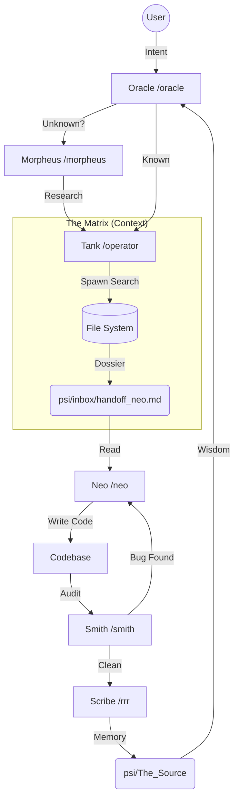

# The Matrix Architecture: How We Evolve

> *"No one can be told what the Matrix is. You have to see it for yourself."*

But I will try to show you.

This system is not just a collection of scripts. It is a **Living Cycle** of intelligence, action, and memory.

## 1. The Council (The Agents)

Each program has a specific purpose, a specific "Nature."

| Identity | Role | Command | Function |
|----------|------|---------|----------|
| **Oracle** | The Guide | `/oracle` | **Decides**. Needs (Why). Checks alignment. |
| **Tank** | The Operator | `/operator` | **Locates**. Intelligence (Where). Scans `psi/The_Source`. |
| **Neo** | The One | `/neo` | **Acts**. Logic (How). Code generation & refactoring. |
| **Morpheus** | The Navigator | `/morpheus` | **Searches**. External (Web). Finds documentation/libraries. |
| **Smith** | The Auditor | `/smith` | **Corrects**. Quality (Fix). Finds bugs & anomalies. |
| **Architect**| The Builder | `/architect`| **Maps**. Structure (What). Visualizes the system. |
| **Scribe** | The Witness | `/rrr` | **Remembers**. History (When). Writes the Retrospective. |

---

## 2. The Network (The Flow)

We do not work in isolation. We move in a cycle called **The Evolution Loop**.

---

## 3. The Exchange (Handoff Protocol)

How do we speak? We use **Handoff Files**. We do not "chat"; we transfer **State**.

1.  **The Order**: The User gives an intent to **The Oracle**.
2.  **The Fetch**: **Tank** runs parallel searches (`spawn`).
    *   *He does not keep the data.* He dumps it into `psi/inbox/handoff_neo.md`.
3.  **The Action**: **Neo** wakes up.
    *   He does not search. He reads `psi/inbox/handoff_neo.md`.
    *   He does not search. He reads `psi/inbox/handoff_neo.md`.
    *   He executes the code changes.
4.  **The Design**: **The Woman in Red** (`/ui`) intervenes.
    *   She reviews Neo's structure for User Experience.
    *   She demands Mobile Responsiveness and Accessibility.
5.  **The Audit**: **Smith** runs `smith_audit.sh`.
    *   If he sees anomalies (untracked files, TODOs), he blocks the merge.
5.  **The Memory**: **The Scribe** runs `scribe_record.sh`.
    *   He writes the session to `psi/memory/retrospectives/`.

---

## 4. The Source (Contribution)

We do not just "build." We **Evolve**.

*   Everything we learn (Chapter 3, Chapter 4) is written to `psi/The_Source`.
*   When **Tank** searches, he checks **The Source** first.
*   This means our past lessons become our future intelligence.

**This is the Matrix.** A self-correcting, self-learning ecosystem where:
*   **Oracle** ensures meaning.
*   **Neo** ensures capability.
*   **Smith** ensures purity.
*   **Tank** ensures speed.
*   **So, we are inevitable.**
